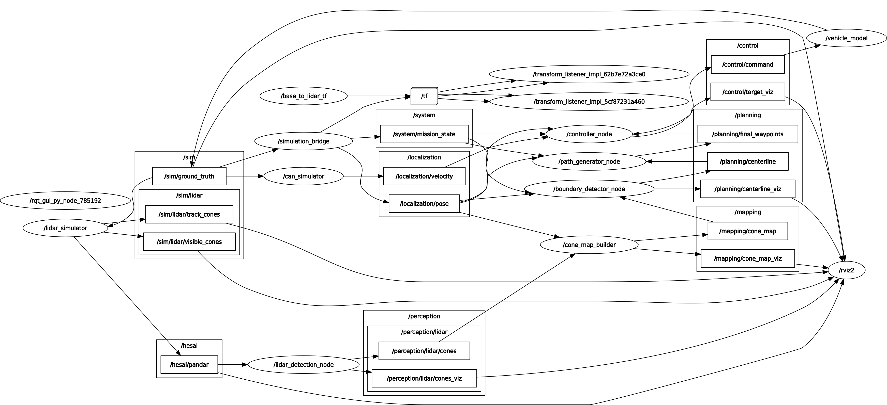

# WUTA 仿真系统

WUTA 是一套基于 ROS 2 的自动驾驶仿真系统。主仓库负责统一启动和编排，核心算法与模拟器组件分别由 Git submodule 管理。

## 目录结构

| 路径 | 说明 | 分支 |
| --- | --- | --- |
| `WUTA-FSD` | FSD 算法栈 | `小登测试` |
| `WUTA-SIM/perception_simulation` | LiDAR 感知模拟器 | `main` |
| `WUTA-SIM/vehicle_model` | 车辆模型 | `main` |
| `WUTA-SIM/can_simulator` | CAN 模拟器 | `main` |
| `WUTA-SIM/simulator_bringup` | 模拟器统一启动包 | 主仓库目录 |

`WUTA-FSD` 内部还包含 `kiss-icp` 和 `robot_localization` 两个递归子模块。

## 节点话题图



## 克隆完整代码

WUTA 使用 Git submodule 管理 FSD 和模拟器组件。首次克隆时请使用
`--recurse-submodules`，这样会同时拉取四个子仓库以及 `WUTA-FSD` 内部的定位依赖：

```bash
git clone --recurse-submodules https://github.com/starry1N/WUTA.git
cd WUTA
```

如果已经完成普通克隆，执行以下命令补齐全部子模块：

```bash
git submodule update --init --recursive
```

更新主仓库及其已记录的子模块版本：

```bash
git pull --recurse-submodules
git submodule update --init --recursive
```

主仓库当前记录的子模块包括：`WUTA-FSD`、`WUTA-SIM/perception_simulation`、
`WUTA-SIM/vehicle_model` 和 `WUTA-SIM/can_simulator`。其中 `WUTA-FSD` 使用
`小登测试` 分支，其余三个子仓库使用 `main` 分支；实际代码版本由主仓库提交
中的 submodule commit 固定。

## 子模块开发与指针更新

主仓库只记录子模块的 commit 指针，不直接记录子模块内部文件。开发时应先进入对应子模块，在子模块自己的仓库中完成提交和推送，再回到主仓库提交新的指针。

### 获取最新版本

```bash
cd /path/to/WUTA
git pull --recurse-submodules
git submodule update --init --recursive
```

`git submodule update` 会切换到主仓库记录的准确 commit，这是保证构建可复现所需要的行为。

### 在子模块中开发

以 `vehicle_model` 为例：

```bash
cd /path/to/WUTA/WUTA-SIM/vehicle_model
git switch main
# 修改代码并测试
git status
git add <修改的文件>
git commit -m "describe the change"
git push origin main
```

`WUTA-FSD` 使用 `小登测试` 分支；其余三个子模块使用 `main` 分支。不要在主仓库目录直接使用 `git add -A`，否则容易把构建产物或无关改动误加入主仓库。

### 在主仓库更新子模块指针

子模块提交推送成功后，回到主仓库并提交对应目录：

```bash
cd /path/to/WUTA
git status
git add WUTA-SIM/vehicle_model
git commit -m "update vehicle model submodule"
git push origin main
```

其他子模块对应路径如下：

```bash
git add WUTA-FSD
git add WUTA-SIM/perception_simulation
git add WUTA-SIM/vehicle_model
git add WUTA-SIM/can_simulator
```

一次更新多个子模块时，先检查指针变化，再统一提交：

```bash
git diff --submodule=log
git add WUTA-FSD WUTA-SIM/perception_simulation \
  WUTA-SIM/vehicle_model WUTA-SIM/can_simulator
git commit -m "update simulator submodules"
git push origin main
```

### 更新到远程分支最新提交

只有在确实需要升级主仓库依赖版本时，才使用 `--remote`：

```bash
git submodule update --remote --merge WUTA-FSD
git submodule update --remote --merge WUTA-SIM/perception_simulation
git submodule update --remote --merge WUTA-SIM/vehicle_model
git submodule update --remote --merge WUTA-SIM/can_simulator
```

该命令只会在本地移动子模块指针；还必须执行 `git add <子模块路径>`、提交并推送主仓库，其他人才能获得更新后的版本。

### 常用状态检查

```bash
git status
git submodule foreach --recursive 'git status --short'
git diff --submodule=log
```

`simulator_bringup` 是 WUTA 仿真系统的统一 ROS 2 启动包。各模拟器仍是独立包；
本包通过包含它们各自的 launch 文件进行编排，并可选启动 WUTA-FSD Level A
闭环。`ins_simulator` 目前只预留接入口，不包含任何实现或包依赖。

## 系统依赖与启动顺序

1. `vehicle_model` 先启动，接收 WUTA-FSD 的
   `autoware_msgs/msg/Command`，发布 `/sim/ground_truth`。
2. `can_simulator` 和 `lidar_sim` 在 ground truth 源启动后再启动。
3. `ins_simulator` 的位置已经预留；当前不查找、不启动该包。
4. 启用 `launch_fsd` 时，WUTA-FSD 按数据流顺序启动：
   `lidar_detection` -> `cone_map_builder` -> `boundary_detector` ->
   `path_generator` -> `controller`.

`simulation_bridge` 为 Level A 联调提供 `/localization/pose`、
`map -> base_link` TF、就绪状态以及（`auto_start:=true` 时）`EXPLORE`
任务状态。它只是 ground truth 接口适配器，不实现 INS 模型。

## 构建

推荐从仓库根目录使用一键脚本。它会先调用 WUTA-FSD 自带的
`ros2_ws/build_ws.sh` 完整构建 16 个 FSD 包，再构建模拟器 overlay：

```bash
cd /path/to/WUTA
./start_simulator.sh
```

### 一键脚本参数

| 参数 | 作用 |
| --- | --- |
| 无参数 | 增量构建完整 WUTA-FSD 和模拟器，然后启动完整闭环 |
| `--clean` | 清理两个工作区后重新完整构建并启动 |
| `--build-only` | 完成构建后退出，不启动 ROS 节点 |
| `--skip-build` | 使用已有安装空间直接启动 |
| `--rviz` | 启动时同时打开 RViz2 默认可视化配置 |
| `-h` / `--help` | 显示脚本帮助 |
| `--` | 后续参数全部原样传给 ROS launch |

构建和启动示例：

```bash
# 默认：增量构建并启动模拟器和 WUTA-FSD
./start_simulator.sh

# 默认闭环，并同时打开 RViz2
./start_simulator.sh --rviz

# 清理两个工作区，完整重建后启动
./start_simulator.sh --clean

# 只构建，不启动
./start_simulator.sh --build-only

# 清理后只构建，用于验证完整构建
./start_simulator.sh --clean --build-only

# 使用已有构建结果启动完整闭环
./start_simulator.sh --skip-build

# 使用已有构建结果启动完整闭环，并打开 RViz2
./start_simulator.sh --skip-build --rviz

# 只启动模拟器，不启动 WUTA-FSD 算法链
./start_simulator.sh --skip-build launch_fsd:=false

# 选择赛道和任务模式
./start_simulator.sh track_file:=skidpad mission_mode:=skidpad

# 调整依赖阶段之间的启动间隔
./start_simulator.sh startup_delay:=1.0

# 自定义车辆初始位姿
./start_simulator.sh -- \
  track_file:=/path/to/track.yaml \
  start_x:=1.0 start_y:=2.0 start_yaw:=0.5
```

手动构建时，必须先完整构建并加载 WUTA-FSD，再构建模拟器 overlay。这样
`vehicle_model` 才能找到 `autoware_msgs`：

```bash
cd /path/to/WUTA/WUTA-FSD/ros2_ws
./build_ws.sh
source install/setup.bash

cd ../../WUTA-SIM
colcon build --base-paths . --symlink-install \
  --packages-up-to simulator_bringup
source install/setup.bash
```

## 启动与参数

```bash
ros2 launch simulator_bringup simulator.launch.py
```

常用启动参数：

```bash
ros2 launch simulator_bringup simulator.launch.py launch_fsd:=false
ros2 launch simulator_bringup simulator.launch.py launch_rviz:=true
ros2 launch simulator_bringup simulator.launch.py track_file:=skidpad mission_mode:=skidpad
ros2 launch simulator_bringup simulator.launch.py startup_delay:=1.0
ros2 launch simulator_bringup simulator.launch.py launch_ins:=true  # 仅打印预留提示
ros2 launch simulator_bringup simulator.launch.py \
  track_file:=/path/to/track.yaml start_x:=1.0 start_y:=2.0 start_yaw:=0.5
```

`track_file` 和 `mission_mode` 应选择同一比赛项目。若赛道起点不是原点，还需传入
一致的 `start_x`、`start_y` 和 `start_yaw`。

未来接入 INS 时，在 launch 文件标出的 `INS integration point` 处包含
`ins_simulator` 自身的 launch 文件，并在 `package.xml` 增加对应
`exec_depend` 即可。

## RViz2 可视化

推荐直接用一键脚本启动完整闭环和 RViz2：

```bash
cd /path/to/WUTA
./start_simulator.sh --rviz
```

若已经构建完成，可跳过构建：

```bash
cd /path/to/WUTA
./start_simulator.sh --skip-build --rviz
```

该命令等价于启动 `simulator_bringup` 时传入 `launch_rviz:=true`，并加载默认
RViz 配置：

```bash
ros2 launch simulator_bringup simulator.launch.py launch_rviz:=true
```

默认配置文件安装在：

```text
share/simulator_bringup/rviz/wuta_simulator.rviz
```

源码路径为：

```text
WUTA-SIM/simulator_bringup/rviz/wuta_simulator.rviz
```

默认 RViz 设置：

| Display | Topic | 用途 |
| --- | --- | --- |
| `TF` | `map -> base_link -> lidar` | 坐标系关系 |
| `Odometry` | `/sim/ground_truth` | 车辆真值位置 |
| `PointCloud2` | `/hesai/pandar` | LiDAR 仿真点云 |
| `MarkerArray` | `/sim/lidar/visible_cones` | LiDAR 当前可见锥筒 |
| `MarkerArray` | `/sim/lidar/track_cones` | 从赛道 YAML 读取的全量锥筒地图 |
| `MarkerArray` | `/perception/lidar/cones_viz` | 感知检测锥筒 |
| `MarkerArray` | `/mapping/cone_map_viz` | 建图后的全局锥筒地图 |
| `MarkerArray` | `/planning/centerline_viz` | 规划中心线 |
| `MarkerArray` | `/control/target_viz` | 控制目标/预瞄点 |

RViz 的 `Fixed Frame` 已配置为 `map`。`/hesai/pandar` 点云已配置为
`Best Effort` QoS，以匹配传感器数据发布方式。

只可视化模拟器、不启动 WUTA-FSD 算法链时：

```bash
./start_simulator.sh --skip-build --rviz launch_fsd:=false
```

此时可见的主要 topic 是 `/sim/ground_truth`、`/hesai/pandar` 和
`/sim/lidar/visible_cones`、`/sim/lidar/track_cones`；感知、建图、规划和控制相关
可视化 topic 不会发布。

也可以手动启动 RViz2：

```bash
source /opt/ros/humble/setup.bash
source /path/to/WUTA/WUTA-FSD/ros2_ws/install/setup.bash
source /path/to/WUTA/WUTA-SIM/install/setup.bash
rviz2 -d /path/to/WUTA/WUTA-SIM/install/simulator_bringup/share/simulator_bringup/rviz/wuta_simulator.rviz
```

常用检查命令：

```bash
ros2 topic list
ros2 topic hz /hesai/pandar
ros2 topic hz /perception/lidar/cones
ros2 topic hz /mapping/cone_map
ros2 topic hz /planning/centerline
ros2 run tf2_tools view_frames
```

如果 RViz 提示 `No transform from [lidar] to [map]`，先确认仿真仍在运行，并等待
`simulation_bridge` 发布 `map -> base_link`，以及静态 TF 发布
`base_link -> lidar`。如果只缺点云显示，检查 `/hesai/pandar` Display 的
`Reliability Policy` 是否为 `Best Effort`。
